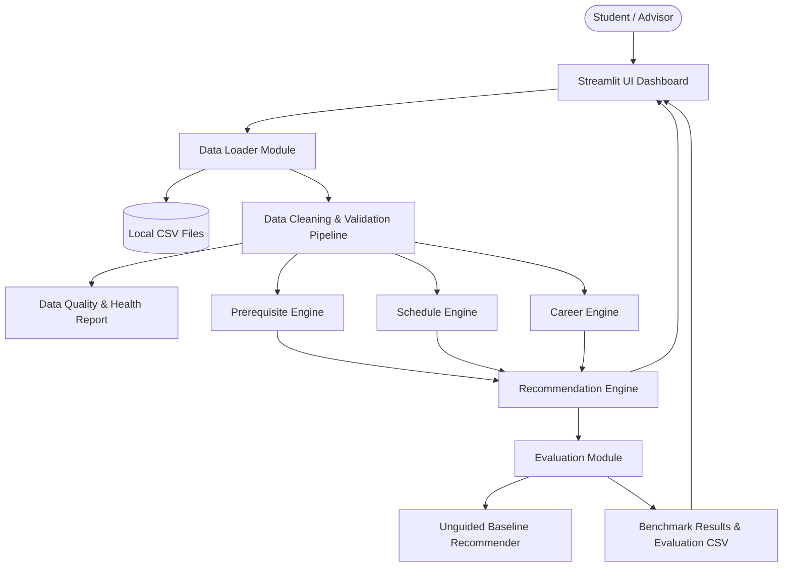

# Architecture Document: Elective Pathway Explorer

## 1. Architectural Overview
The **Elective Pathway Explorer** is structured as a modular, layered Python application designed for maintainability, explainability, and zero-cost local execution. It separates data ingestion, relational cleaning, business logic engines, automated evaluation, and presentation layers.

## 2. Component Specifications

### 2.1 Data Ingestion & Cleaning Layer (`src/data_loader.py`, `src/data_cleaning.py`)
- **Schema Enforcement**: Validates required columns across 6 CSV datasets (`courses.csv`, `prerequisites.csv`, `schedules.csv`, `career_paths.csv`, `career_course_mapping.csv`, `students.csv`).
- **Data Hygiene**: Eliminates duplicate rows, normalizes course and career IDs (trimmed uppercase), and resolves missing text descriptions.
- **Relational Integrity**: Cross-references foreign keys to quarantine corrupt records (e.g. prerequisites referencing non-existent courses or schedules referencing unlisted courses).
- **Diagnostics Reporting**: Generates real-time health metrics (`total_records`, `valid_records`, `invalid_records`, `missing_values`, `duplicate_records`).

### 2.2 Core Engines Layer (`src/`)
1. **Prerequisite Engine (`prerequisite_engine.py`)**:
   - Evaluates direct requirements and recursively crawls multi-hop prerequisite ancestry chains.
   - Parses student transcript grades against minimum letter grade criteria ($A > B > C > D > F$).
   - Returns structured status (`Eligible`, `Missing Prerequisite`, `Prerequisite Grade Not Satisfied`) with natural language explanations.
2. **Schedule Engine (`schedule_engine.py`)**:
   - Parses time strings into minutes from midnight.
   - Performs interval overlap detection:
     $$\text{Overlap} = \max(S_1, S_2) < \min(E_1, E_2) \quad \text{when } D_1 = D_2$$
   - Detects semester offering mismatches and credit overloads.
3. **Career Engine (`career_engine.py`)**:
   - Computes career alignment scores ($0.0$ to $1.0$) based on direct curricular mapping and keyword outcome overlap.
   - Identifies mastered competencies versus remaining skill gaps for each pathway.
4. **Recommendation Engine (`recommendation_engine.py`)**:
   - Implements the exact specified weighting:
     $$\text{Score} = 0.30 \times \text{Prereq} + 0.30 \times \text{Career} + 0.20 \times \text{Outcome} + 0.10 \times \text{Schedule} + 0.10 \times \text{Preference}$$
   - Strictly enforces prerequisite clearing: courses with unmet prerequisites receive an eligibility score of 0 and are disqualified from valid recommendations.
   - Generates transparent pedagogical explanations.

### 2.3 Evaluation & Baseline Layer (`src/baseline.py`, `src/evaluation.py`)
- **Baseline Model**: Simulates unguided student behavior where electives are selected based on generic popularity or naive keyword searches without prerequisite verification or schedule validation.
- **Comparative Benchmark**: Evaluates all 20 synthetic students programmatically, exporting `evaluation/evaluation_results.csv` and comparing against strict institutional target metrics.

### 2.4 Presentation Layer (`app.py`)
- Built with **Streamlit** and **Plotly**.
- Organized into 8 intuitive tabs: Recommendations, Prerequisite Checker, Schedule Engine, Career Pathways, Course Comparator, Final Validation Basket, Evaluation Dashboard, and Edge Cases & Health.
